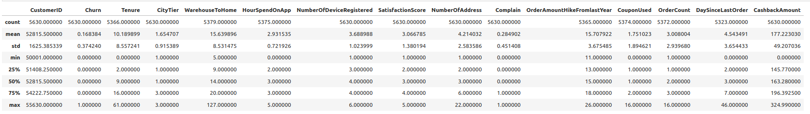
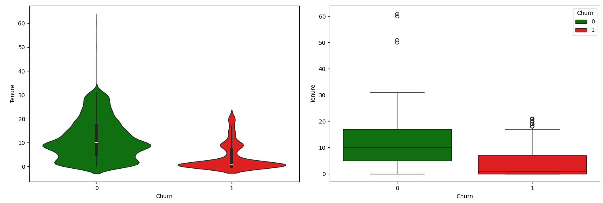
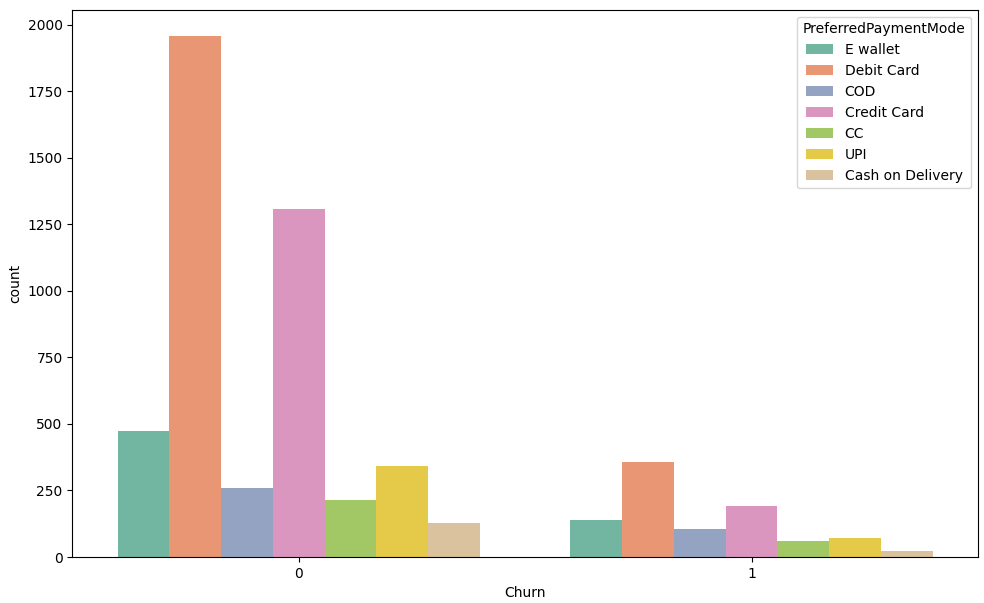
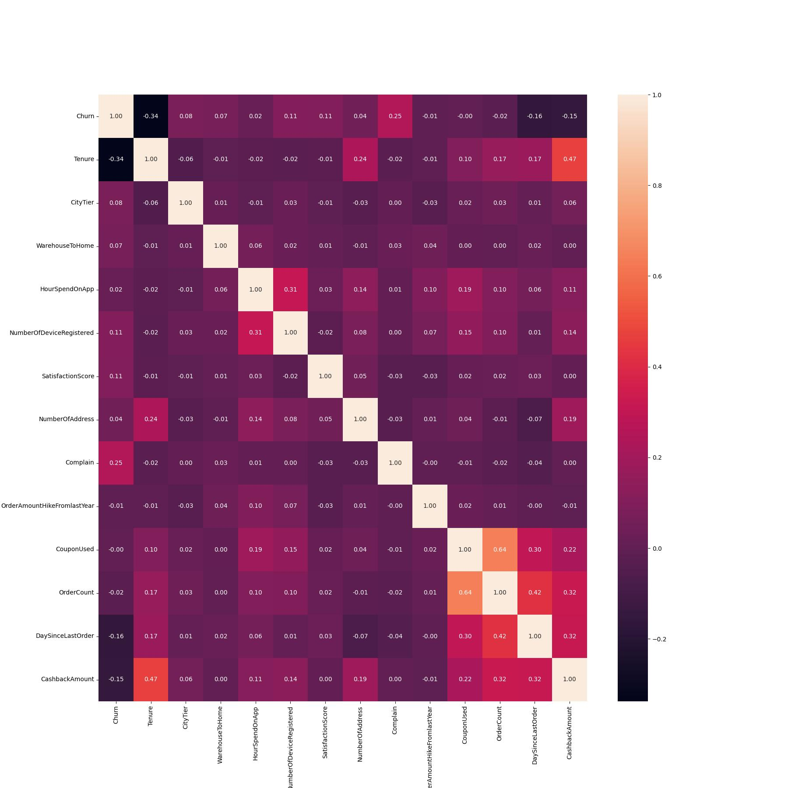
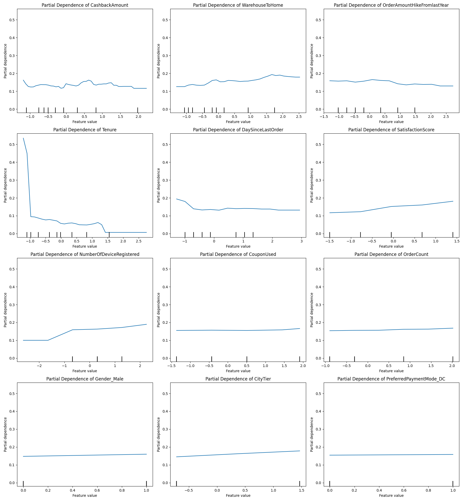
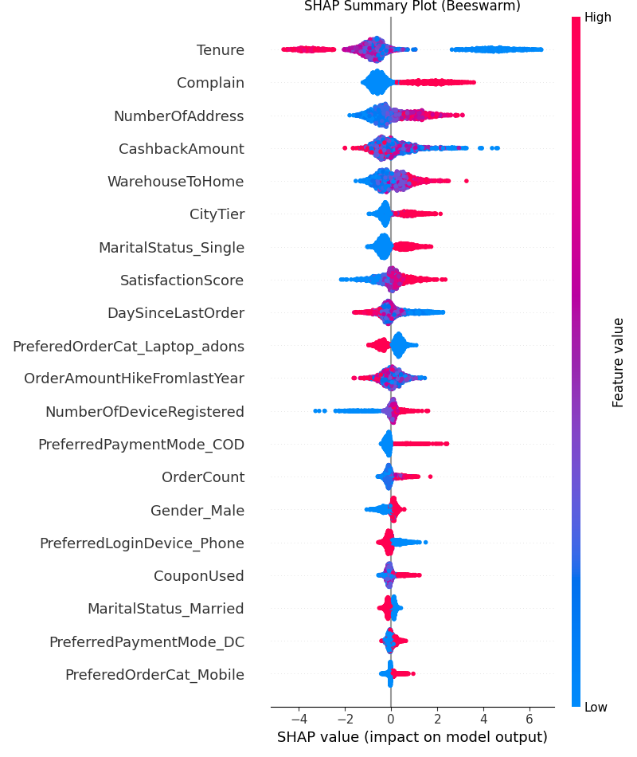

# Customer Churn for an E-Commerce company

[Click here to access the Streamlit app](https://your-streamlit-app-url)

## Table of Contents
1. [Introduction](#introduction)
2. [Project Motivation](#project-motivation)
3. [Data](#data)
4. [Exploratory Data Analysis (EDA)](#exploratory-data-analysis-eda)
5. [Data Preprocessing](#data-preprocessing)
6. [Modeling](#modeling)
7. [Evaluation](#evaluation)
8. [Results](#results)
9. [Deployment](#deployment)
10. [Conclusion](#conclusion)
11. [Recommendations](#recommendations)
12. [Dependencies](#dependencies)
13. [Contact](#contact)

## Introduction
This particular business problem is about customer Churn. The data set belongs to a leading online E-Commerce company. The company wants to know the customers who are going to churn, so accordingly they can approach customer to offer some promos and prevent the churn. The problem would require understanding the dataset and coming up with insights that can fulfil the business goal. To predict Customer Churn, we will have to come up with a Binary Classification model that is able to use the data at hand and predict whether a customer will churn in the coming future.

## Project Motivation from a Business Prospective
- Companies lose **$1.6 trillion per year** due to customer churn!
-  It will **cost you 16 times** more to bring a new customer up to the same level as an existing customer.
-  the Harvard Business School report claims that on average, a **5% increase in customer retention rates results in 25% – 95% increase of profits**. And the lion’s share – **65% of a company’s business comes from existing customers!**
- According to Gartner, a staggering **80% of a company’s future revenue will come from just 20% of its existing customers**. Meanwhile, Marketing Metrics claims that the probability of selling to an existing customer is 60-70%, and only 5-20% to sell to a new prospect

## Data
The dataset consists of 5600 data points and 20 features. The dataset for this project can be accessed here - [Data](data/E_Commerce_Dataset.xlsx).

## Exploratory Data Analysis (EDA)
Conducted in-depth Exploratory Data Analysis to understand the data distribution, identify outliers, and determine feature correlations.The key steps of EDA were:
- Missing Value Check
- Univariate Analysis - Boxplots, Histograms, Countplots
- Bivariate Analysis - Boxplots, Violin Plots, Gender Distribution across Categorical Features, Churn Distribution across Categories, Scatter Plots
- Multivariate Analysis - Pair Plots, Heatmaps
- Data Skew, Data Kurtosis

    

        
        
    

    

        

            
            
        

    

## Data Preprocessing
- Handling missing values
- Variable Transformations
- Encoding categorical variables
- Outlier Treatment
- Feature scaling
- Feature Engineering (K-means cluster centers as a Feature)
- Multicollinearity Check

    
    
    

## Modeling
This was a Binary Classification model so a multitude of ML models were tried out to find the best model. The modeling workflow is as defined below:
- Analyze Base Models:
    - **Linear Discriminant Analysis**
    - **Logistic Regression**
    - **ADA Boost Classifier**
    - **Decision Tree Classifier**
    - **Random Forest Classifier**
    - **KNN Model**
    - **Quadratic Discriminant Analysis**
    - **XGBoost Model**
    - **MLP Classifier**
- Hyperparameter Tuning for the base models using **GridSearchCV**

## Evaluation
- Evaluated model performance using metrics such as **classification report, accuracy, precision, recall, F1-score, AUC score, and ROC curve**.
- Addressed overfitting through **K-fold cross-validation**, ensuring the model's generalizability to new data.

## Results
The final model was chosen to be the XGBoost model as it gave the best performance.
- The Model performance metrics are shown below:
- Model Feature Importance:
- Partial Dependence Plots for top features
- Model Calibration Plot
- Model Learning Curve Plot
- SHAP summary plot, Beeswarm Plot, Dependence Plot, Interaction Plot, Decision Plot

    

        
    

    

        
    

    

        
    

    

        
    

    

        
    

    

        
    

## Deployment
- Created an interactive web application using Streamlit.
- Users can input customer data and get real-time churn predictions.
- Hosted the Streamlit app on Streamlit Community Cloud for easy access.

[Click here to access the Streamlit app](https://your-streamlit-app-url)

## Conclusion
- **Tenure**: Most of the customers who churned had a tenure of about 15 months.
- **City Tier**: Customers belonging to low-tier cities had a higher churn rate than those in high-tier cities.
- **Registered Devices**: The customers who churned had a lesser number of registered devices with the company.
- **Satisfaction Score**: A major chunk of customers who churned had a satisfaction score higher than 3.
- **Complaints**: Customers who raised complaints churned, whereas those who didn't raise complaints tended not to churn.
- **Preferred Login Device**: Customers whose preferred login device is a mobile churned in lesser amounts than those who prefer computers.

## Recommendations
- **Enhance Customer Experience**: The company needs to focus on retaining both old and new customers by providing a superior overall customer experience. This includes better customer engagements, introducing new offers, and discounts.
- **Expand Cashback Offers**: The company should introduce more cashback offers and in a wider variety. These can be direct monetary cashbacks or coupons for discounts on future purchases to incentivize continued customer engagement.
- **Improve Distribution and Delivery**: Establish more distribution centers and work on faster delivery options to meet customer expectations and improve satisfaction.
- **Frequent Sales and Promotions**: Regularly launch sales and promotional offers to keep customers engaged. Daily, weekly, or monthly deals can help maintain customer interest and boost sales.
- **Strengthen Customer Service**: The company must engage customers through various mass media channels and ensure the customer service department operates smoothly. Excellent customer service is crucial for enhancing the customer experience.
- **Uniform Service Quality**: The company needs to evaluate its performance across different cities and ensure consistent quality of service. Strategies should reflect the importance of all customers, regardless of location, to maintain loyalty and satisfaction.

## Dependencies
The project dependencies are listed in the `requirements.txt` file. 
[Click Here to access the file](requirements.txt).

## Contact
For questions, feedback, or collaboration, please reach out to:
- **Name**: Anmol Dwivedi
- **Email**: dwivedi.anmol1996@gmail.com
- **LinkedIn**: [LinkedIn](https://www.linkedin.com/in/anmol-dwivedi-2537691a0)
